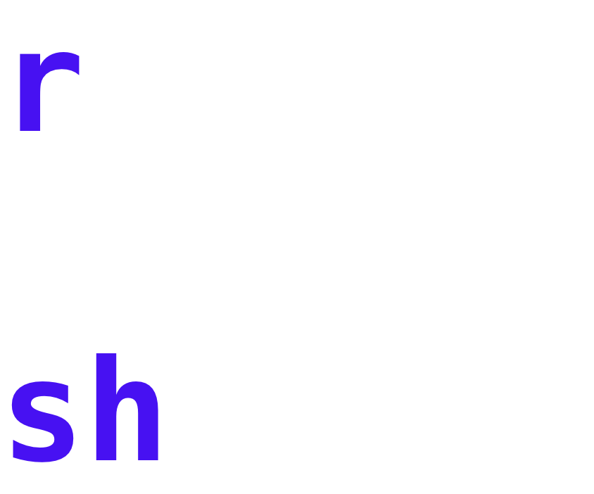
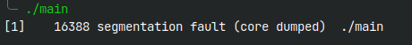

# 
### Rust Reverse Shell

<details>
<summary>Contents</summary>

- [](#)
    - [Rust Reverse Shell](#rust-reverse-shell)
  - [What is rsh?](#what-is-rsh)
  - [Installation](#installation)
    - [Commands](#commands)
    - [Inspection](#inspection)
  - [Usage](#usage)
    - [Server](#server)
    - [Client](#client)
  - [FAQ](#faq)
    - [- Why is it "rsh"? Shouldn't it be "rrs"?](#--why-is-it-rsh-shouldnt-it-be-rrs)
    - [- Why Rust? Why not \[insert lang\]?](#--why-rust-why-not-insert-lang)

</details>

## What is rsh?
_**rsh is a reverse shell written in Rust.**_
<br>
It is a Work In Progress, and not ready for use yet.
<br><br>
In a reverse shell, the server listens for connections, and the client connects to it.
The client is the one that executes the commands and sends it back to the server.

## Installation
_Note: Installation instructions do not currently work._
<br>
rsh can be installed on your system by running one of the commands below in your terminal.
An installation script will be run. You must have git, and either `curl` or `wget` installed.

### Commands
| Method    | Command                                                                                            |
| :-------- |:---------------------------------------------------------------------------------------------------|
| **curl**  | `/bin/bash -c "$(curl -fsSL https://raw.githubusercontent.com/simonfalke-01/rsh/main/install.sh)"` |
| **wget**  | `/bin/bash -c "$(wget -O- https://raw.githubusercontent.com/simonfalke-01/rsh/main/install.sh)"`   |
| **fetch** | `/bin/bash -c "$(fetch -o - https://raw.githubusercontent.com/simonfalke-01/rsh/main/install.sh)"` |

### Inspection
If you would like to inspect the script before running it, you can download the script by running the following command:
```bash
wget https://raw.githubusercontent.com/simonfalke-01/rsh/main/install.sh
```
After you are done, you can run the script with
```bash
chmod +x ./install.sh && ./install.sh
```

## Usage
The server script should be run first, which sets up a listener (default on port 8080, localhost, if none are specified).
<br>
Run the following commands on the respective systems. Substitute `<address>` and `<port>` for the address and port that you would like to bind/connect to.
### Server
```bash
$ rsh server <address> -p <port>
```
### Client
```bash
$ rsh client <address> -p <port>
```

## FAQ
### - Why is it "rsh"? Shouldn't it be "rrs"?
A simple diagram for this:
<br><br><br>
<p align="center">

</p>
<br>
Don't ask.

### - Why Rust? Why not [insert lang]?


<br><br><br><br>

michelle please be my girlfriend
