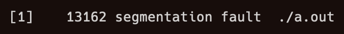

# 
### Rust Reverse Shell

## What is rsh?
rsh is a reverse shell written in Rust.
It is a Work In Progress, and not ready for use yet.
<br>
In a reverse shell, the server listens for connections, and the client connects to it.
The client is the one that executes the commands and sends it back to the server.

## Usage
### Server
```bash
$ rsh server <address> <port>
```
### Client
```bash
$ rsh client <address> <port>
```

## FAQ
### - Why is it "rsh"? Shouldn't it be "rrs"?
A simple diagram for this:
<br>

<br>
Don't ask.

### - Why Rust? Why not C?


### - Why can't I just use Metasploit or Netcat?
In fact, you should.

<br><br><br>

michelle please be my girlfriend